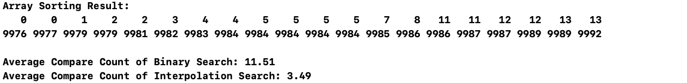
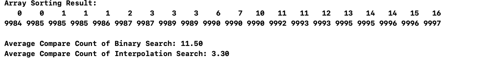
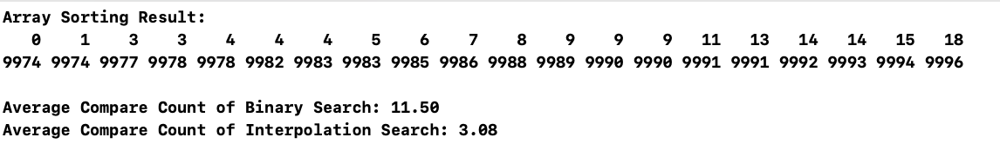

# InterpolationSearch{Result Image}

Interpolation Search는 데이터가 균등하게 분포되어 있는 경우에 Binary Search보다 적은 비교 횟수를 요구할 수 있다. 이는 Interpolation Search가 단순히 중간값을 선택하는 Binary Search와 달리, 탐색 대상 값이 데이터 내에서 나타날 가능성이 높은 위치를 계산하여 직접 접근하기 때문이다.
구체적으로, Interpolation Search는 데이터의 선형적인 증가를 가정하고, 탐색 범위를 더 효율적으로 줄일 수 있으며, 특히 데이터가 정렬되어 있고 값 간의 간격이 일정할수록 적은 횟수의 비교로도 목표 값을 찾을 가능성이 높아진다.
반면 Binary Search는 항상 탐색 구간의 정확히 중간값을 기준으로 나누기 때문에, 데이터 분포가 균등하더라도 비교 횟수가 Interpolation Search보다 더 많아질 수 있다.
