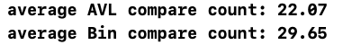
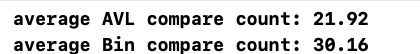
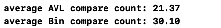

# compareAVL{Result Image}

AVL 트리는 항상 균형을 유지하므로, 탐색 과정에서 안정적으로 낮은 비교 횟수를 보인다.
BST는 삽입 순서와 트리 구조에 따라 탐색 성능이 크게 달라지며, 트리가 불균형해지면 탐색 성능이 AVL 트리보다 크게 떨어질 수 있다.
따라서, 데이터 삽입과 삭제가 빈번히 발생하는 환경에서는 AVL 트리를 사용하는 것이 탐색 효율을 높이는 데 유리하다. 반면, 삽입 순서가 고르게 분포하거나 균형이 중요한 요구 사항이 없는 경우에는 BST를 고려할 수 있다.
